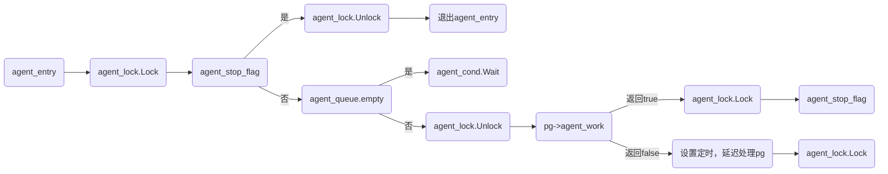
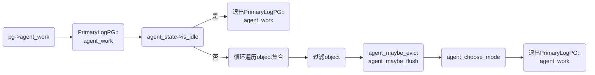
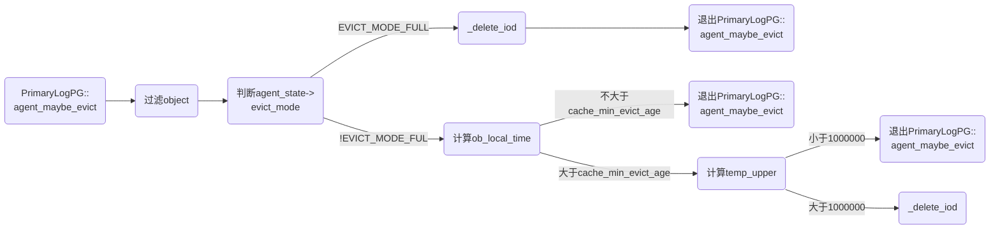
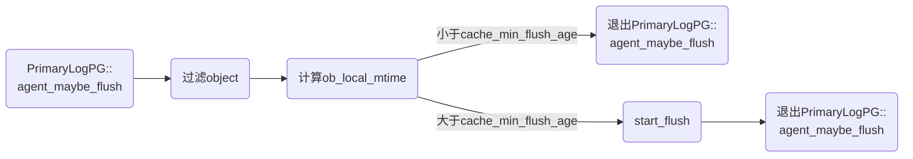
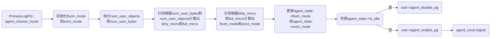

> Ceph版本：14.2.22  

&nbsp;
### 1. OSDService::agent_entry
文件路径：`ceph/src/osd/OSD.cc`

OSD服务启动过程中会创建一个名为osd_srv_agent的线程，在分层存储中，该线程负责缓存池与数据池之间的数据迁移工作。该线程一旦启动，便调用agent_entry函数，进入一个无限循环中。当需要将缓存池数据迁移到存储池中或者从缓存池中删除一些数据时，该线程会被唤醒，去执行处理缓存池中PG的任务。否则该线程会一直在这个循环中等该被唤醒。该函数主要完成以下任务：
- 判断agent_queue是否为空，如果为空，agent线程停在这里等待被唤醒。如果不为空，继续执行下面工作；
- 从agent_queue队列中获取一个待处理的PG SET；
- 设置agent线程处理单个PG的最大任务数(flush+evict) max以及flush最大操作数agent_flush_quota；
- 调用pg->agent_work执行flush/evict任务；
- 如果pg->agent_work需要延迟处理flush/evict，执行延迟处理；



```cpp
void OSDService::agent_entry()
{
  dout(10) << __func__ << " start" << dendl;
  agent_lock.Lock();

  //agent_stop_flag是线程停止标志,初始值为false,当osd服务停止时,会将该值设置为true
  while (!agent_stop_flag)
  {
    //agent_queue是一个map,该map是pg set的映射,其中pg set是将要处理的pg
    //当需要flush或者evict时,将需要处理的pg加入到agent_queue中
    if (agent_queue.empty())
    {
      dout(20) << __func__ << " empty queue" << dendl;
      //当没有达到flush或者evict条件时,agent_queue始终时空的,停在这里等待
      //当达到flush或者evict条件时,便会唤醒该线程
      agent_cond.Wait(agent_lock);
      continue;
    }

    //flush or evict
    uint64_t level = agent_queue.rbegin()->first;//获取agent_queue中最后一个map的key
    set<PGRef> &top = agent_queue.rbegin()->second;//获取agent_queue中最后一个map的value

    dout(10)  << __func__
              << " tiers " << agent_queue.size()
              << ", top is " << level
              << " with pgs " << top.size()
              << ", ops " << agent_ops << "/" << cct->_conf->osd_agent_max_ops
              << (agent_active ? " active" : " NOT ACTIVE") << dendl;

    dout(20) << __func__ << " oids " << agent_oids << dendl;

    //osd_agent_max_ops设置flush+evict最大操作总数,初始值为4
    //agent_ops统计evict+flush操作总次数,初始值为0
    int max = cct->_conf->osd_agent_max_ops - agent_ops;
    int agent_flush_quota = max;//初始flush操作的最大次数

    //flush_mode_high_count统计高速flush模式的次数,初始值为0
    //如果flush_mode_high_count为0,说明此时flush模式为低速flush,需要减少agent_flush_quota
    //osd_agent_max_low_ops设置低俗模式下flush+evict最大操作总数,初始值为2
    if (!flush_mode_high_count)
    {
      agent_flush_quota = cct->_conf->osd_agent_max_low_ops - agent_ops;
    }

    if (agent_flush_quota <= 0 || top.empty() || !agent_active)
    {
      agent_cond.Wait(agent_lock);
      continue;
    }

    //agent_queue_pos标记当前处理的pg在pg set中的位置
    if (!agent_valid_iterator || agent_queue_pos == top.end())
    {
      agent_queue_pos = top.begin();//初始化agent_queue_pos为pg set中第一个pg
      agent_valid_iterator = true;
    }

    PGRef pg = *agent_queue_pos;

    dout(10)  << "high_count " << flush_mode_high_count
              << " agent_ops " << agent_ops
              << " flush_quota " << agent_flush_quota << dendl;

    agent_lock.Unlock();

    //调用pg->agent_work,执行flush/evict操作
    //如果返回false,说明需要延迟处理
    if (!pg->agent_work(max, agent_flush_quota))
    {

      dout(10)  << __func__
                << " " << pg->pg_id
                << " no agent_work, delay for " << cct->_conf->osd_agent_delay_time
                << " seconds" << dendl;

      osd->logger->inc(l_osd_tier_delay);
      // Queue a timer to call agent_choose_mode for this pg in 5 seconds
      //设置5s定时,每隔5s调用agent_choose_mode_restart,重新计算flush/evict模式
      agent_timer_lock.Lock();
      Context *cb = new AgentTimeoutCB(pg);
      agent_timer.add_event_after(cct->_conf->osd_agent_delay_time, cb);
      agent_timer_lock.Unlock();
    }

    agent_lock.Lock();
  }

  agent_lock.Unlock();
  dout(10) << __func__ << " finish" << dendl;
}
```
从上面代码可以看到，能够打破osd_srv_agent线程处于睡眠状态的一个关键点在于agent_queue是否为非空。而agent_queue的改变是在PrimaryLogPG::agent_choose_mode函数中改变的，下文会详细分析该函数。

### 2. PrimaryLogPG::agent_work
文件路径：`ceph/src/osd/PrimaryLog.cc`

从上面代码的后半部分可以看到，osd_srv_agent线程会通过pg->agent_work去执行具体的任务。在agent_work函数中，主要完成以下任务：
- 加载hit set，hit set表示缓存池命中object集合，作为后续的flush object或者evict object的参考对象集合；
- 从缓存池里获取一组待处理的有序object并放入到一个object集合ls中；
- 循环遍历集合ls，检查当前object是否满足flush/evict资格，如果满足，执行flush或evict操作；
- 更新agent_state信息，记录当前PG已经处理的object总数、下一次要处理的object的起始位置等信息；
- 调用agent_choose_mode，重新计算缓存池是否需要flush/evict；



```cpp
bool PrimaryLogPG::agent_work(int start_max, int agent_flush_quota)
{
  lock();

  //agent_state描述了agent线程处理PG的状态信息
  //如果为空,agent线程可能有问题,正常情况下agent线程一定有值
  if (!agent_state)
  {
    dout(10) << __func__ << " no agent state, stopping" << dendl;
    unlock();
    return true;
  }

  ceph_assert(!deleting);

  //is_idle表明agent线程处于闲置状态,即不需要执行flush也不需要执行evict任务
  if (agent_state->is_idle())
  {
    dout(10) << __func__ << " idle, stopping" << dendl;
    unlock();
    return true;
  }

  osd->logger->inc(l_osd_agent_wake);

  dout(10)  << __func__
            << " max " << start_max
            << ", flush " << agent_state->get_flush_mode_name()
            << ", evict " << agent_state->get_evict_mode_name()
            << ", pos " << agent_state->position << dendl;

  ceph_assert(is_primary());
  ceph_assert(is_active());

  //加载缓存池object命中集合,也就是将缓存池中将要处理的object添加到agent_state->hit_set_map中,等待处理
  agent_load_hit_sets();

  //获取数据存储池
  const pg_pool_t *base_pool = get_osdmap()->get_pg_pool(pool.info.tier_of);
  ceph_assert(base_pool);

  int ls_min = 1;

  //设置从filestore或者bluestore中一次获取object最大数量
  int ls_max = cct->_conf->osd_pool_default_cache_max_evict_check_size;

  // list some objects.  this conveniently lists clones (oldest to
  // newest) before heads... the same order we want to flush in.
  //
  // NOTE: do not flush the Sequencer.  we will assume that the
  // listing we get back is imprecise.

  //存放将要处理的object
  vector<hobject_t> ls;

  //指向下一个ls_max的起始object
  hobject_t next;

  //从filestore或者bluestore的agent_state->position起始位置开始
  //获取不超过ls_max数量的object,并存放到ls中。next是下一个ls_max的起始位置
  int r = pgbackend->objects_list_partial(agent_state->position, ls_min, ls_max, &ls, &next);
  ceph_assert(r >= 0);
  dout(20) << __func__ << " got " << ls.size() << " objects" << dendl;

  //循环处理ls容器中的object
  int started = 0;
  for (vector<hobject_t>::iterator p = ls.begin(); p != ls.end(); ++p)
  {
    //下面是对object的过滤
    if (p->nspace == cct->_conf->osd_hit_set_namespace)
    {
      dout(20) << __func__ << " skip (hit set) " << *p << dendl;
      osd->logger->inc(l_osd_agent_skip);
      continue;
    }
    if (is_degraded_or_backfilling_object(*p))
    {
      dout(20) << __func__ << " skip (degraded) " << *p << dendl;
      osd->logger->inc(l_osd_agent_skip);
      continue;
    }
    if (is_missing_object(p->get_head()))
    {
      dout(20) << __func__ << " skip (missing head) " << *p << dendl;
      osd->logger->inc(l_osd_agent_skip);
      continue;
    }
    ObjectContextRef obc = get_object_context(*p, false, NULL);
    if (!obc)
    {
      // we didn't flush; we may miss something here.
      dout(20) << __func__ << " skip (no obc) " << *p << dendl;
      osd->logger->inc(l_osd_agent_skip);
      continue;
    }
    if (!obc->obs.exists)
    {
      dout(20) << __func__ << " skip (dne) " << obc->obs.oi.soid << dendl;
      osd->logger->inc(l_osd_agent_skip);
      continue;
    }
    if (range_intersects_scrub(obc->obs.oi.soid, obc->obs.oi.soid.get_head()))
    {
      dout(20) << __func__ << " skip (scrubbing) " << obc->obs.oi << dendl;
      osd->logger->inc(l_osd_agent_skip);
      continue;
    }
    if (obc->is_blocked())
    {
      dout(20) << __func__ << " skip (blocked) " << obc->obs.oi << dendl;
      osd->logger->inc(l_osd_agent_skip);
      continue;
    }

    if (obc->is_request_pending())
    {
      dout(20) << __func__ << " skip (request pending) " << obc->obs.oi << dendl;
      osd->logger->inc(l_osd_agent_skip);
      continue;
    }

    //纠删码数据池不支持omap类型的object,bluestore模式下的object都是omap类型的
    //所以一般情况下,数据池采用副本方式,而不采取纠删码
    // be careful flushing omap to an EC pool.
    if (!base_pool->supports_omap() && obc->obs.oi.is_omap())
    {
      dout(20) << __func__ << " skip (omap to EC) " << obc->obs.oi << dendl;
      osd->logger->inc(l_osd_agent_skip);
      continue;
    }

    //下面这个函数的关键部分
    //if:先处理evict任务, else:处理flush任务
    if (agent_state->evict_mode != TierAgentState::EVICT_MODE_IDLE && agent_maybe_evict(obc, false))
        ++started;
    else if (agent_state->flush_mode != TierAgentState::FLUSH_MODE_IDLE && agent_flush_quota > 0 &&
              agent_maybe_flush(obc))
    {
      ++started;
      --agent_flush_quota;//限制flush object个数
    }

    //started表示当前PG中已经flush或者evict的object数量,started受ls_max限制,started<=ls_max
    //start_max规定agent线程处理单个PG的最大任务总数,以便每个PG被处理的机会是相同的
    //所以started不能超过start_max,如果超过,立即停止处理当前PG中的object,并重新设置下一次处理
    //该PG中object的位置
    if (started >= start_max)
    {
      // If finishing early, set "next" to the next object
      if (++p != ls.end())
          next = *p;
      break;
    }
  }

  //下面是处理完一个PG中所有任务之后的操作
  if (++agent_state->hist_age > cct->_conf->osd_agent_hist_halflife)
  {
    dout(20) << __func__ << " resetting atime and temp histograms" << dendl;
    agent_state->hist_age = 0;
    agent_state->temp_hist.decay();
  }

  // Total objects operated on so far
  //统计agent线程在当前PG上处理过的总的object数量
  int total_started = agent_state->started + started;

  //延迟处理下一个PG的标志
  bool need_delay = false;

  dout(20)  << __func__
            << " start pos " << agent_state->position
            << " next start pos " << next << " started "
            << total_started << dendl;

  // See if we've made a full pass over the object hash space
  // This might check at most ls_max objects a second time to notice that
  // we've checked every objects at least once.

  if (agent_state->position < agent_state->start && next >= agent_state->start)
  {
    dout(20) << __func__ << " wrap around " << agent_state->start << dendl;

    if (total_started == 0)
      need_delay = true;
    else
      total_started = 0;

    agent_state->start = next;
  }

  //将agent线程已经处理过的object总数量记录在agent_state中
  agent_state->started = total_started;

  // See if we are starting from beginning
  if (next.is_max())
    agent_state->position = hobject_t();
  else
    agent_state->position = next;

  // Discard old in memory HitSets
  //从命中的object集合中删除一些时间比较久的object,删除的数量为pool.info.hit_set_count
  hit_set_in_memory_trim(pool.info.hit_set_count);

  //延迟处理下一个PG
  if (need_delay)
  {
    ceph_assert(agent_state->delaying == false);
    agent_delay();
    unlock();
    return false;
  }
  //处理完当前PG后,重新统计缓存池中flush和evict比例,然后决定是否继续flush/evict
  agent_choose_mode();
  unlock();
  return true;
}
```

### 3. PrimaryLogPG::agent_maybe_evict
文件路径：`ceph/src/osd/PrimaryLog.cc`

从agent_work中可以看到，如果满足条件，则会调用agent_maybe_evict，该函数主要完成以下任务：
-  判断当前要处理的object是否有资格被evict；
- 判断当前evict_mode是否为EVICT_MODE_FULL，如果是则直接执行后面的evict操作；如果不是，再根据当前object在缓存池中的时间是否达到evict时间以及当前object的热度值，最终决定是否要evict当前object；
- 调整agent_op操作数；
- 调用_delete_oid函数将该object从缓存池中删除；



```cpp
bool PrimaryLogPG::agent_maybe_evict(ObjectContextRef &obc, bool after_flush)
{
  //获取当前被处理的object
  const hobject_t &soid = obc->obs.oi.soid;

  //下面是判断该object是否有资格被evict
  if (!after_flush && obc->obs.oi.is_dirty())
  {
    dout(20) << __func__ << " skip (dirty) " << obc->obs.oi << dendl;
    return false;
  }

  // This is already checked by agent_work() which passes after_flush = false
  if (after_flush && range_intersects_scrub(soid, soid.get_head()))
  {
    dout(20) << __func__ << " skip (scrubbing) " << obc->obs.oi << dendl;
    return false;
  }

  if (!obc->obs.oi.watchers.empty())
  {
    dout(20) << __func__ << " skip (watchers) " << obc->obs.oi << dendl;
    return false;
  }

  if (obc->is_blocked())
  {
    dout(20) << __func__ << " skip (blocked) " << obc->obs.oi << dendl;
    return false;
  }

  if (obc->obs.oi.is_cache_pinned())
  {
    dout(20) << __func__ << " skip (cache_pinned) " << obc->obs.oi << dendl;
    return false;
  }

  if (soid.snap == CEPH_NOSNAP)
  {
    int result = _verify_no_head_clones(soid, obc->ssc->snapset);

    if (result < 0)
    {
      dout(20) << __func__ << " skip (clones) " << obc->obs.oi << dendl;
      return false;
    }
  }

  //根据evict_mode决定是否要对当前object热度进行计算,
  //最终根据object热度是否满足条件,做出最终的evict决定
  //如果evict_mode==EVICT_MODE_FULL,不需要计算该object热度值,直接evict
  //如果evict_mode!=EVICT_MODE_FULL,需要计算该该object热度值
  if (agent_state->evict_mode != TierAgentState::EVICT_MODE_FULL)
  {
    // is this object old than cache_min_evict_age?
    //获取当前时间戳
    utime_t now = ceph_clock_now();
    utime_t ob_local_mtime;

    if (obc->obs.oi.local_mtime != utime_t())
    {
      ob_local_mtime = obc->obs.oi.local_mtime;
    }
    else
    {
      ob_local_mtime = obc->obs.oi.mtime;
    }

    //计算当前object在缓存池中呆的时间,如果超过了cache_min_evict_age,需要evict
    //如果没有超过,不用evict
    if (ob_local_mtime + utime_t(pool.info.cache_min_evict_age, 0) > now)
    {
      dout(20) << __func__ << " skip (too young) " << obc->obs.oi << dendl;
      osd->logger->inc(l_osd_agent_skip);
      return false;
    }

    //下面是计算该object的热度值
    // is this object old and/or cold enough?
    int temp = 0;
    uint64_t temp_upper = 0, temp_lower = 0;

    if (hit_set)
    {
      agent_estimate_temp(soid, &temp);//计算热度
    }

    //将热度添加到热度直方图中
    agent_state->temp_hist.add(temp);

    //获取热度区间比例值
    agent_state->temp_hist.get_position_micro(temp, &temp_lower, &temp_upper);

    dout(20)  << __func__
              << " temp " << temp
              << " pos " << temp_lower
              << "-" << temp_upper
              << ", evict_effort " << agent_state->evict_effort << dendl;
    dout(30)  << "agent_state:\n";

    Formatter *f = Formatter::create("");
    f->open_object_section("agent_state");
    agent_state->dump(f);
    f->close_section();
    f->flush(*_dout);
    delete f;
    *_dout << dendl;

    //将热度区间比例值与evict_effort对比,决定是否要执行evict
    if (1000000 - temp_upper >= agent_state->evict_effort)
    {
      return false;
    }

  }

  //下面是执行evict操作
  dout(10) << __func__ << " evicting " << obc->obs.oi << dendl;

  //创建一个回调函数
  OpContextUPtr ctx = simple_opc_create(obc);
  auto null_op_req = OpRequestRef();

  if (!ctx->lock_manager.get_lock_type(ObjectContext::RWState::RWWRITE, obc->obs.oi.soid, obc, null_op_req))
  {
    close_op_ctx(ctx.release());
    dout(20) << __func__ << " skip (cannot get lock) " << obc->obs.oi << dendl;
    return false;
  }

  //agent_ops计数
  osd->agent_start_evict_op();
  ctx->register_on_finish([this]() { osd->agent_finish_evict_op(); });
  ctx->at_version = get_next_version();
  ceph_assert(ctx->new_obs.exists);

  //执行删除操作
  int r = _delete_oid(ctx.get(), true, false);

  //更新delta_stats信息
  if (obc->obs.oi.is_omap())
  {
    ctx->delta_stats.num_objects_omap--;
  }

  ctx->delta_stats.num_evict++;
  ctx->delta_stats.num_evict_kb += shift_round_up(obc->obs.oi.size, 10);

  if (obc->obs.oi.is_dirty())
  {
    --ctx->delta_stats.num_objects_dirty;
  }

  ceph_assert(r == 0);

  finish_ctx(ctx.get(), pg_log_entry_t::DELETE);
  simple_opc_submit(std::move(ctx));
  osd->logger->inc(l_osd_tier_evict);
  osd->logger->inc(l_osd_agent_evict);
  return true;
}
```
在agent_maybe_evict过程中涉及到计算object的热度值，此处不做详细介绍；

### 4. PrimaryLogPG::agent_maybe_flush
文件路径：`ceph/src/osd/PrimaryLog.cc`

从agent_work中可以看到，如果满足条件，则会调用agent_maybe_flush，该函数主要完成以下任务：
- 判断当前object是否有资格被flush
- 判断当前evict_mode是否为EVICT_MODE_FULL，如果是则直接执行后面的flush操作；如果不是，再根据当前object在缓存池中的时间是否达到flush时间，最终决定是否flush；
- 调整agent_op操作数；
- 调用start_flush将当前object从缓存池迁移到存储池中；



```cpp
bool PrimaryLogPG::agent_maybe_flush(ObjectContextRef &obc)
{
  //下面是判断该object是否有资格被flush
  if (!obc->obs.oi.is_dirty())
  {
    dout(20) << __func__ << " skip (clean) " << obc->obs.oi << dendl;
    osd->logger->inc(l_osd_agent_skip);
    return false;
  }

  if (obc->obs.oi.is_cache_pinned())
  {
    dout(20) << __func__ << " skip (cache_pinned) " << obc->obs.oi << dendl;
    osd->logger->inc(l_osd_agent_skip);
    return false;
  }

  //获取时间戳
  utime_t now = ceph_clock_now();
  utime_t ob_local_mtime;

  if (obc->obs.oi.local_mtime != utime_t())
  {
    ob_local_mtime = obc->obs.oi.local_mtime;
  }
  else
  {
    ob_local_mtime = obc->obs.oi.mtime;
  }

  //如果当前evict_mode为EVICT_MODE_FULL,直接跳过时间比较
  //如果当前evict_mode不是EVICT_MODE_FULL,需要计算时间
  //如果当前object在缓存池中呆的时间已经超过了cache_min_flush_age,可以flush,否则不行
  bool evict_mode_full = (agent_state->evict_mode == TierAgentState::EVICT_MODE_FULL);

  if (!evict_mode_full &&
      obc->obs.oi.soid.snap == CEPH_NOSNAP && // snaps immutable; don't delay
      (ob_local_mtime + utime_t(pool.info.cache_min_flush_age, 0) > now))
  {
    dout(20) << __func__ << " skip (too young) " << obc->obs.oi << dendl;
    osd->logger->inc(l_osd_agent_skip);
    return false;
  }

  //如果当前object正在flush,直接跳过
  if (osd->agent_is_active_oid(obc->obs.oi.soid))
  {
    dout(20) << __func__ << " skip (flushing) " << obc->obs.oi << dendl;
    osd->logger->inc(l_osd_agent_skip);
    return false;
  }

  dout(10) << __func__ << " flushing " << obc->obs.oi << dendl;

  // FIXME: flush anything dirty, regardless of what distribution of
  // ages we expect.

  hobject_t oid = obc->obs.oi.soid;
  //agent_ops计数
  osd->agent_start_op(oid);
  // no need to capture a pg ref, can't outlive fop or ctx
  std::function<void()> on_flush = [this, oid]() { osd->agent_finish_op(oid); };

  //开始flush
  int result = start_flush(OpRequestRef(), obc, false, NULL, on_flush);

  if (result != -EINPROGRESS)
  {
    on_flush();
    dout(10) << __func__ << " start_flush() failed " << obc->obs.oi << " with " << result << dendl;
    osd->logger->inc(l_osd_agent_skip);
    return false;
  }

  osd->logger->inc(l_osd_agent_flush);
  return true;
}
```

### 5. PrimaryLogPG::agent_choose_mode
文件路径：`ceph/src/osd/PrimaryLog.cc`

从上面函数可以看到agent_state在每个函数中都起到决定性地位。在agent_work中，agent_state->evict_mode和agent_state->flush_mode的值决定要不要进行evict和flush判断。在agent_maybe_evict和agent_maybe_flush中agent_state->evict_mode的值决定要不要直接执行evict或者flush。而agent_state值的计算过程是在agent_choose_mode函数中。该函数主要完成以下任务：
- 统计当前PG中dirty object数量和当前PG中所有的object数量；
- 统计当前PG中dirty object占用的字节数和当前PG中所有object占用的总的字节数；
- 分别从object数量角度和object占用的字节数角度计算dirty占比和full占比；
- 计算当前flush mode和evict mode；
- 更新agent_state->flush_mode和agent_state->evict_mode；
- 根据当前flush mode和evict mode决定是要将当前PG加入到待处理的PG队列中；



```cpp
bool PrimaryLogPG::agent_choose_mode(bool restart, OpRequestRef op)
{
  bool requeued = false;

  // Let delay play out
  if (agent_state->delaying)
  {
    dout(20) << __func__ << " " << this << " delaying, ignored" << dendl;
    return requeued;
  }

  //初始化flush_mode和evict_mode
  TierAgentState::flush_mode_t flush_mode = TierAgentState::FLUSH_MODE_IDLE;
  TierAgentState::evict_mode_t evict_mode = TierAgentState::EVICT_MODE_IDLE;
  unsigned evict_effort = 0;

  //检查当前PG是否正常
  if (info.stats.stats_invalid)
  {
    // idle; stats can't be trusted until we scrub.
    dout(20) << __func__ << " stats invalid (post-split), idle" << dendl;
    goto skip_calc;
  }

  //下面主要是计算flush_mode和evict_mode
  {
    //获取当前缓存池PG数量因子,可以理解为当前缓存池中PG的总数量
    uint64_t divisor = pool.info.get_pg_num_divisor(info.pgid.pgid);
    ceph_assert(divisor > 0);

    // adjust (effective) user objects down based on the number
    // of HitSet objects, which should not count toward our total since
    // they cannot be flushed.
    // 统计当前PG中既在缓存池里又在命中集合里的object数量,这些不能被flush下去
    uint64_t unflushable = info.stats.stats.sum.num_objects_hit_set_archive;

    // also exclude omap objects if ec backing pool
    //获取数据存储池
    const pg_pool_t *base_pool = get_osdmap()->get_pg_pool(pool.info.tier_of);
    ceph_assert(base_pool);

    //纠删码数据池不支持omap类型的object,bluestore存储引擎下的object都是omap类型的
    //所以应排除调用omap类型的object
    if (!base_pool->supports_omap())
    {
      unflushable += info.stats.stats.sum.num_objects_omap;
    }

    //统计当前PG中object总数,并排除掉不能flush掉的object
    uint64_t num_user_objects = info.stats.stats.sum.num_objects;

    if (num_user_objects > unflushable)
    {
      num_user_objects -= unflushable;
    }
    else
    {
      num_user_objects = 0;
    }

    //统计当前PG中object总字节数
    uint64_t num_user_bytes = info.stats.stats.sum.num_bytes;

    //统计当前当前PG中既在缓存池里又在命中集合里的object总字节数
    uint64_t unflushable_bytes = info.stats.stats.sum.num_bytes_hit_set_archive;

    //排除掉flush掉的object的总字节数
    num_user_bytes -= unflushable_bytes;

    //ceph存储引擎会为每一个object存储额外固定大小的信息,因此这部分也应该统计在内
    uint64_t num_overhead_bytes = osd->store->estimate_objects_overhead(num_user_objects);
    num_user_bytes += num_overhead_bytes;

    // also reduce the num_dirty by num_objects_omap
    //统计当前PG中被修改的object数量;dirty:表示object有变化
    int64_t num_dirty = info.stats.stats.sum.num_objects_dirty;

    //从dirty object数量中排除掉omap类型的object
    if (!base_pool->supports_omap())
    {
      if (num_dirty > info.stats.stats.sum.num_objects_omap)
      {
        num_dirty -= info.stats.stats.sum.num_objects_omap;
      }
      else
      {
         num_dirty = 0;
      }

    }

    dout(10) << __func__ << " flush_mode: " << TierAgentState::get_flush_mode_name(agent_state->flush_mode)
              << " evict_mode: " << TierAgentState::get_evict_mode_name(agent_state->evict_mode)
              << " num_objects: " << info.stats.stats.sum.num_objects
              << " num_bytes: " << info.stats.stats.sum.num_bytes
              << " num_objects_dirty: " << info.stats.stats.sum.num_objects_dirty
              << " num_objects_omap: " << info.stats.stats.sum.num_objects_omap << " num_dirty: " << num_dirty
              << " num_user_objects: " << num_user_objects << " num_user_bytes: " << num_user_bytes
              << " num_overhead_bytes: " << num_overhead_bytes
              << " pool.info.target_max_bytes: " << pool.info.target_max_bytes
              << " pool.info.target_max_objects: " << pool.info.target_max_objects << dendl;

    // get dirty, full ratios
    //初始化当前PG中dirty object占比已经full占比
    uint64_t dirty_micro = 0;
    uint64_t full_micro = 0;

    //根据字节数计算出缓存池中平均一个PG中dirty和full的平均占比(注意2个平均)
    if (pool.info.target_max_bytes && num_user_objects > 0)
    {
      uint64_t avg_size = num_user_bytes / num_user_objects;
      dirty_micro = num_dirty * avg_size * 1000000 / std::max<uint64_t>(pool.info.target_max_bytes / divisor, 1);
      full_micro = num_user_objects * avg_size * 1000000 / std::max<uint64_t>(pool.info.target_max_bytes / divisor, 1);
    }

    //根据object数量计算出缓存池中平均一个PG中dirty和full的平均占比(注意2个平均)
    if (pool.info.target_max_objects > 0)
    {
      //计算缓存池中平均一个PG中dirty的平均占比
      uint64_t dirty_objects_micro = num_dirty * 1000000 / std::max<uint64_t>(pool.info.target_max_objects / divisor, 1);

      //比较获取最终的dirty的平均占比
      if (dirty_objects_micro > dirty_micro)
      {
        dirty_micro = dirty_objects_micro;
      }

      //计算缓存池中平均一个PG中full的平均占比
      uint64_t full_objects_micro = num_user_objects * 1000000 / std::max<uint64_t>(pool.info.target_max_objects / divisor, 1);

      //比较获取最终的full的平均占比
      if (full_objects_micro > full_micro)
      {
        full_micro = full_objects_micro;
      }

    }

    dout(20)  << __func__
              << " dirty " << ((float)dirty_micro / 1000000.0)
              << " full " << ((float)full_micro / 1000000.0) << dendl;

    // flush mode
    // 下面是计算flush mode
    //获取用户配置的低速flush时候的dirty占比
    uint64_t flush_target = pool.info.cache_target_dirty_ratio_micro;

    //获取用户配置的高速flush时后的dirty占比
    uint64_t flush_high_target = pool.info.cache_target_dirty_high_ratio_micro;

    //设置flush模式下dirty占比调优值,防止爆满
    uint64_t flush_slop = (float)flush_target * cct->_conf->osd_agent_slop;

    if (restart || agent_state->flush_mode == TierAgentState::FLUSH_MODE_IDLE)
    {
      flush_target += flush_slop;
      flush_high_target += flush_slop;
    }
    else
    {
      flush_target -= std::min(flush_target, flush_slop);
      flush_high_target -= std::min(flush_high_target, flush_slop);
    }

    //如果计算出来的dirty占比超过了flush_high_target,则采用flush hight模式
    if (dirty_micro > flush_high_target)
    {
      flush_mode = TierAgentState::FLUSH_MODE_HIGH;
    }
    else if (dirty_micro > flush_target || (!flush_target && num_dirty > 0))
    {
      //如果计算出来的dirty占比超过flush_target,则采用flush low模式
      //如果即便dirty占比没有达到要求,但用户配置了flush_target并且num_dirty数量大于0
      //也采用flush low模式
      flush_mode = TierAgentState::FLUSH_MODE_LOW;
    }


    // evict mode
    //下面是计算evict模式
    //获取用户配置的evict时的full占比
    uint64_t evict_target = pool.info.cache_target_full_ratio_micro;

    //设置evict模式下full占比调优值,防止爆满
    uint64_t evict_slop = (float)evict_target * cct->_conf->osd_agent_slop;

    if (restart || agent_state->evict_mode == TierAgentState::EVICT_MODE_IDLE)
    {
      evict_target += evict_slop;
    }
    else
    {
      evict_target -= std::min(evict_target, evict_slop);
    }

    //如果full占比超过了1,则采用evict full模式
    if (full_micro > 1000000)
    {
      // evict anything clean
      evict_mode = TierAgentState::EVICT_MODE_FULL;
      evict_effort = 1000000;
    }//如果full占比超过了evict_target,则采用evict some模式
    else if (full_micro > evict_target)
    {
      // set effort in [0..1] range based on where we are between
      evict_mode = TierAgentState::EVICT_MODE_SOME;
      uint64_t over = full_micro - evict_target;
      uint64_t span = 1000000 - evict_target;

      //计算实际超出evict_target部分与理论应该剩余空间的比例
      //比如理论上达到60%时开始evict,则剩余空间站40%,也就是说40%是安全空间
      //实际计算出来的是80%,则超出20%,evict_effort=20%/40%,evict_effort越小越好
      evict_effort = std::max(over * 1000000 / span, uint64_t(1000000.0 * cct->_conf->osd_agent_min_evict_effort));

      // quantize effort to avoid too much reordering in the agent_queue.
      //设置evict_effort的调优值
      uint64_t inc = cct->_conf->osd_agent_quantize_effort * 1000000;
      ceph_assert(inc > 0);
      uint64_t was = evict_effort;
      evict_effort -= evict_effort % inc;

      if (evict_effort < inc)
      {
        evict_effort = inc;
      }

      ceph_assert(evict_effort >= inc && evict_effort <= 1000000);
      dout(30)  << __func__
                << " evict_effort " << was
                << " quantized by " << inc
                << " to " << evict_effort << dendl;
    }
  }

//下面是更新agent_state
skip_calc:
  //获取上一次agent_state状态
  bool old_idle = agent_state->is_idle();

  //更新当前agent_state->flush_mode
  if (flush_mode != agent_state->flush_mode)
  {
    dout(5) << __func__
            << " flush_mode " << TierAgentState::get_flush_mode_name(agent_state->flush_mode)
            << " -> " << TierAgentState::get_flush_mode_name(flush_mode) << dendl;

    //如果当前是flush hight,前一次是flush low,
    //增加flush_mode_hight_count计数,标志当前PG中所有object的high flush状态为1
    if (flush_mode == TierAgentState::FLUSH_MODE_HIGH)
    {
      osd->agent_inc_high_count();
      info.stats.stats.sum.num_flush_mode_high = 1;
    }//如果当前是flush low,前一次是flush high,标志当前PG中所有object的low flush状态为1
    else if (flush_mode == TierAgentState::FLUSH_MODE_LOW)
    {
      info.stats.stats.sum.num_flush_mode_low = 1;
    }

    //如果当前是flush low,前一次是flush hight,
    //减少flush_mode_hight_count计数,标志当前PG中所有object的high flush状态为0
    if (agent_state->flush_mode == TierAgentState::FLUSH_MODE_HIGH)
    {
      osd->agent_dec_high_count();
      info.stats.stats.sum.num_flush_mode_high = 0;
    }//如果当前是flush high,前一次是flush low,标志当前PG中所有object的low flush状态为0
    else if (agent_state->flush_mode == TierAgentState::FLUSH_MODE_LOW)
    {
      info.stats.stats.sum.num_flush_mode_low = 0;
    }

    //更新agent_state->flush_mode
    agent_state->flush_mode = flush_mode;
  }

  //更新当前agent_state->evict_mode
  if (evict_mode != agent_state->evict_mode)
  {
    dout(5) << __func__
            << " evict_mode " << TierAgentState::get_evict_mode_name(agent_state->evict_mode)
            << " -> " << TierAgentState::get_evict_mode_name(evict_mode) << dendl;

    if (agent_state->evict_mode == TierAgentState::EVICT_MODE_FULL && is_active())
    {
        if (op)
        {
          requeue_op(op);
        }

        requeue_ops(waiting_for_flush);
        requeue_ops(waiting_for_active);
        requeue_ops(waiting_for_scrub);
        requeue_ops(waiting_for_cache_not_full);
        objects_blocked_on_cache_full.clear();
        requeued = true;
    }

    //如果当前evict_mode为evict some,前一次为evict full,标记当前PG中所有object的evict some状态为1
    if (evict_mode == TierAgentState::EVICT_MODE_SOME)
    {
      info.stats.stats.sum.num_evict_mode_some = 1;
    }//如果当前evict_mode为evict full,前一次为evict some,标记当前PG中所有object的evict full状态为1
    else if (evict_mode == TierAgentState::EVICT_MODE_FULL)
    {
      info.stats.stats.sum.num_evict_mode_full = 1;
    }

    //如果当前evict_mode为evict full,前一次为evict some,标记当前PG中所有object的evict some状态为0
    if (agent_state->evict_mode == TierAgentState::EVICT_MODE_SOME)
    {
      info.stats.stats.sum.num_evict_mode_some = 0;
    }//如果当前evict_mode为evict some,前一次为evict full,标记当前PG中所有object的evict full状态为0
    else if (agent_state->evict_mode == TierAgentState::EVICT_MODE_FULL)
    {
      info.stats.stats.sum.num_evict_mode_full = 0;
    }

    //更新agent_state->evict_mode
    agent_state->evict_mode = evict_mode;
  }

  //获取上一次agent_state->evict_effort
  uint64_t old_effort = agent_state->evict_effort;

  //更新当前agent_state->evict_effort
  if (evict_effort != agent_state->evict_effort)
  {
    dout(5) << __func__
            << " evict_effort " << ((float)agent_state->evict_effort / 1000000.0)
            << " -> " << ((float)evict_effort / 1000000.0) << dendl;

    agent_state->evict_effort = evict_effort;
  }

  // NOTE: we are using evict_effort as a proxy for *all* agent effort
  // (including flush).  This is probably fine (they should be
  // correlated) but it is not precisely correct.

  //如果当前agent_state is idle,表明缓存池不需要flush也不要evict
  //is idle:flush_mode=FLUSH_MODE_IDLE && evict_mode=EVICT_MODE_IDLE
  if (agent_state->is_idle())
  {
    //如果前一次agent_state is not idle,说明当前PG之前被处理过,需要将当前PG从agent_queue中移除
    if (!restart && !old_idle)
    {
      //将当前PG从agent_queue中移除
      osd->agent_disable_pg(this, old_effort);
    }

  }//如果当前agent_state is not idle,表明缓存池需要flush或者evict
  else
  { //如果前一次agent_state is idle,说明当前PG之前没有被处理过,需要将当前PG添加到agent_queue中
    if (restart || old_idle)
    {
      osd->agent_enable_pg(this, agent_state->evict_effort);
    }//如果前一次agent_state is not idle,说明当前PG之前被处理过,需要调整agent_queue中当前PG对应的evict_effort
    else if (old_effort != agent_state->evict_effort)
    {
      osd->agent_adjust_pg(this, old_effort, agent_state->evict_effort);
    }

  }

  return requeued;
}
```

### 6. OSDService::_enqueue
文件路径：`ceph/src/osd/OSD.h`

从agent_choose_mode最后可以看到，如果缓存池需要flush或者evict，需要将待处理的PG加入到agent_queue队列中，这一动作是最终通过调用_enqueue函数实现，该函数主要完成以下任务：
- 判断是否需要调整agent线程要处理哪个pg set；
- 将待处理的pg加入到pg set中；
- 唤醒agent线程，执行flush或者evict任务；

```cpp
//将待处理的PG加入到agent_queue队列中
void _enqueue(PG *pg, uint64_t priority)
{
  //如果agent_queue不为空,说明agent_queue已经存在待处理的pg set;
  //该pg set可能是其他pg set,也可能是当前pg所在的pg set;
  //如果agent_queue.rbegin()->first < priority,说明待处理pg set是其他pg set;
  //此时我们需要处理当前pg   所在的pg set;
  //因此要设置agent_valid_iterator=false,用来调整agent线程处理哪个pg set;
  //agent_valid_iterator=false时,会获取agent_queue中最新的pg set;
  if (!agent_queue.empty() && agent_queue.rbegin()->first < priority)
  {
    agent_valid_iterator = false; // inserting higher-priority queue
  }

  //获取priority对应的pg set
  set<PGRef> &nq = agent_queue[priority];

  //如果pg set为空,则唤醒agent线程,执行flush或者evict操作
  //如果pg set不为空,即agent_queue不为空,说明agent线程已经在正常工作了,不需要被唤醒
  if (nq.empty())
  {
    agent_cond.Signal();
  }

  //将当前pg 插入到pg set中
  nq.insert(pg);
}
```

### 7. OSDService::_dequeue
文件路径：`ceph/src/osd/OSD.h`

从agent_choose_mode最后可以看到，如果缓存池需不需要flush或者evict，但是如果之前agent线程有处理过该PG，需要将待处理的PG从agent_queue队列中移除掉，这一动作最终通过调用_dequeue函数实现，该函数主要完成以下任务：
- 根据old_priority从agent_queue队列中获取到相应的pg set；
- 在pg set中查找要移除的PG；如果找到了，从pg set中删除，并调整下一个要处理的PG；
- 如果删除之后的pg set没有任何一个PG，需要从agent_queue队列中移除，并调整下一个要处理的pg set；

```cpp
void _dequeue(PG *pg, uint64_t old_priority)
{
  //获取old_priority对应的pg set
  set<PGRef> &oq = agent_queue[old_priority];

  //从pg set中查找当前pg
  set<PGRef>::iterator p = oq.find(pg);
  ceph_assert(p != oq.end());

  //如果agent线程正在处理的pg正好是当前pg,需要调整下一个要处理的pg
  //因为该pg要从pg set中被删除掉
  if (p == agent_queue_pos)
  {
    ++agent_queue_pos;
  }

  //从pg set 中删除该pg
  oq.erase(p);

  //如果删除掉该pg后,pg set中没有任何一个pg
  //将该pg set从agent_queue中删除
  if (oq.empty())
  {
      //如果当前要删除的pg set正好是agent_queue队列中最后一个
      //需要设置agent_valid_iterator=false,用来调整agent线程处理哪个pg set
      if (agent_queue.rbegin()->first == old_priority)
      {
        agent_valid_iterator = false;
      }

      //从agent_queue队列中删除掉当前pg set
      agent_queue.erase(old_priority);
  }
}
```