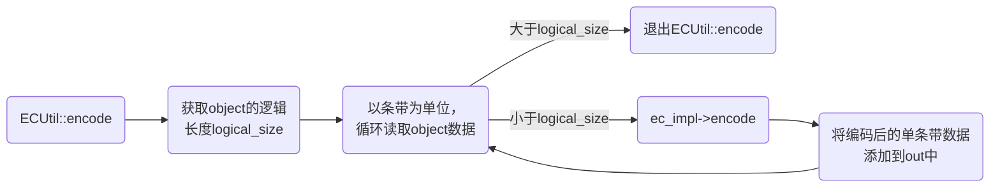
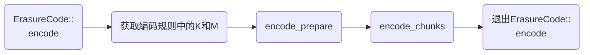
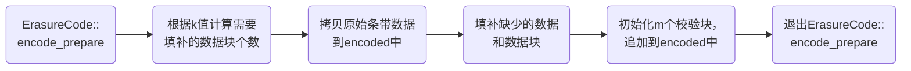
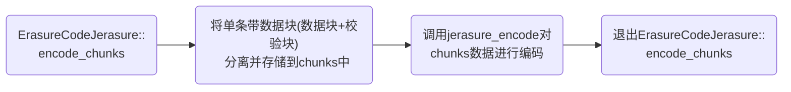

> Ceph版本：14.2.22  

&nbsp;
### 1. encode_and_write
`文件路径：ceph/src/osd/ECTransaction.cc`

osd在写数据时，最终会通过encode_and_write函数，该函数中会先根据数据块编码生成校验块，最后将数据块和校验块一起写入底层。

```cpp
void encode_and_write(pg_t pgid, const hobject_t &oid, const ECUtil::stripe_info_t &sinfo,
                      ErasureCodeInterfaceRef &ecimpl, const set<int> &want, uint64_t offset, bufferlist bl,
                      uint32_t flags, ECUtil::HashInfoRef hinfo, extent_map &written,
                      map<shard_id_t, ObjectStore::Transaction> *transactions, DoutPrefixProvider *dpp)
{
  const uint64_t before_size = hinfo->get_total_logical_size(sinfo);
  ceph_assert(sinfo.logical_offset_is_stripe_aligned(offset));
  ceph_assert(sinfo.logical_offset_is_stripe_aligned(bl.length()));
  ceph_assert(bl.length());

  map<int, bufferlist> buffers;
  //计算校验块数据
  //sinfo存储分片信息，bl输入的数据，want统计分片编号，buffers输出数据
  int r = ECUtil::encode(sinfo, ecimpl, bl, want, &buffers);
  ceph_assert(r == 0);

  written.insert(offset, bl.length(), bl);

  ldpp_dout(dpp, 20) << __func__ << ": " << oid << " new_size " << offset + bl.length() << dendl;

  if (offset >= before_size)
  {
    ceph_assert(offset == before_size);
    hinfo->append(sinfo.aligned_logical_offset_to_chunk_offset(offset), buffers);
  }

  for (auto &&i : *transactions)
  {
    ceph_assert(buffers.count(i.first));
    bufferlist &enc_bl = buffers[i.first];
    if (offset >= before_size)
    {
      i.second.set_alloc_hint(coll_t(spg_t(pgid, i.first)), ghobject_t(oid, ghobject_t::NO_GEN, i.first), 0, 0,
                              CEPH_OSD_ALLOC_HINT_FLAG_SEQUENTIAL_WRITE | CEPH_OSD_ALLOC_HINT_FLAG_APPEND_ONLY);
    }
    i.second.write(coll_t(spg_t(pgid, i.first)), ghobject_t(oid, ghobject_t::NO_GEN, i.first),
                   sinfo.logical_to_prev_chunk_offset(offset), enc_bl.length(), enc_bl, flags);
  }
}
```

### 2. ECUtil::encode
`文件路径：ceph/src/osd/ECUtil.cc`

上面分析到，encode_and_write函数会调用encode计算校验块数据，encode是类ECUtil的方法。该方法将循环读取一个条带数据(数据块)，调用相应接口，编码出校验块数据，最后将单条带数据(数据块+校验块)有序地追加到bufferlist结构中。


```cpp
int ECUtil::encode(const stripe_info_t &sinfo, ErasureCodeInterfaceRef &ec_impl, bufferlist &in, const set<int> &want,
                   map<int, bufferlist> *out)
{
  //获取单个object的逻辑长度
  uint64_t logical_size = in.length();

  ceph_assert(logical_size % sinfo.get_stripe_width() == 0);
  ceph_assert(out);
  ceph_assert(out->empty());

  if (logical_size == 0)
    return 0;

  //for:将object的数据切割成条带，并以条带为单元进行数据编码
  for (uint64_t i = 0; i < logical_size; i += sinfo.get_stripe_width())
  {
    map<int, bufferlist> encoded;//临时存储编码后的单条带数据(原数据块+校验块)
    bufferlist buf;//临时存储编码前的原始单条带数据(原数据块)

    buf.substr_of(in, i, sinfo.get_stripe_width());//获取一个条带的数据(原数据块)
    //调用encode进行编码，将编码后的单条带数据(原数据块+校验块)临时放在encoded
    int r = ec_impl->encode(want, buf, &encoded);
    ceph_assert(r == 0);

    //将编码后的单条带数据(原数据块+校验块)按照blocksize大小添加到out中
    for (map<int, bufferlist>::iterator i = encoded.begin(); i != encoded.end(); ++i)
    {
      ceph_assert(i->second.length() == sinfo.get_chunk_size());
      (*out)[i->first].claim_append(i->second);
    }
  }

  for (map<int, bufferlist>::iterator i = out->begin(); i != out->end(); ++i)
  {
    ceph_assert(i->second.length() % sinfo.get_chunk_size() == 0);
    ceph_assert(sinfo.aligned_chunk_offset_to_logical_offset(i->second.length()) == logical_size);
  }

  return 0;
}
```

### 3. ErasureCode::encode
`文件路径：ceph/src/erasure-code/ErasureCode.cc`

上面分析到，ECUtil::encode会调用ec_impl->encode计算校验块数据，ec_impl->encode是类ErasureCode的方法。该方法首先会调用相应接口，计算单条带数据(数据块)大小是否是blocksize的倍数，如果不是，需要对该条带数据(数据块)进行补空块。然后再调用相应接口，对条带数据(数据块+校验快)做进一步处理。


```cpp
int ErasureCode::encode(const set<int> &want_to_encode, const bufferlist &in, map<int, bufferlist> *encoded)
{
    //获取k、m
    unsigned int k = get_data_chunk_count();//获取编码策略中数据块个数
    unsigned int m = get_chunk_count() - k;//获取编码策略中校验块个数
    bufferlist out;
    //检查原始条带数据(数据块)是否需要补空块
    //并初始化m个空白校验块到encoded中
    int err = encode_prepare(in, *encoded);
    if (err)
        return err;
    
    //根据算法，对m个空白块进行数据填充(编码过程)
    encode_chunks(want_to_encode, encoded);
    for (unsigned int i = 0; i < k + m; i++)
    {
        if (want_to_encode.count(i) == 0)
            encoded->erase(i);
    }
    return 0;
}
```

### 4. ErasureCode::encode_prepare
`文件路径：ceph/src/erasure-code/ErasureCode.cc`

上面分析到，ErasureCode::encode会调用encode_prepare计算条带数据(数据块)是否需要补空块。encode_prepare是类ErasureCode的方法。该方法先计算需要补空字符的块的个数，根据需要补块的数量，把数据块的内容拷贝到bufferlist中。然后对补块处理。补块处理分为两部分：第一部分，最后一块有数据内容，但数据大小不满足blocksize整倍数的数据块在末尾追加空字符处理。第二部分，整个条带剩下的，直接用blocksize大小的空快覆盖处理。补块处理完毕后，再处理校验块，直接初始化新块作为校验块，然后追加到encoded中。此时的条带就被拓展成数据块+校验块。


```cpp
int ErasureCode::encode_prepare(const bufferlist &raw, map<int, bufferlist> &encoded) const
{
  unsigned int k = get_data_chunk_count();//获取编码策略中数据块个数
  unsigned int m = get_chunk_count() - k;//获取编码策略中校验块个数
  unsigned blocksize = get_chunk_size(raw.length());//获取逻辑块大小
  unsigned padded_chunks = k - raw.length() / blocksize;//计算需要补空块的数据块个数
  bufferlist prepared = raw;//单条带(数据块)

  //for:拷贝原始条带数据到encoded中
  //将单条带数据按照blocksize大小切割
  //然后将blocksize大小的块数据拷贝到encoded中
  for (unsigned int i = 0; i < k - padded_chunks; i++)
  {
    bufferlist &chunk = encoded[chunk_index(i)];//临时存放一个blocksize大小的块数据
    chunk.substr_of(prepared, i * blocksize, blocksize);//从原始条带数据中读取blocksize大小数据块到chunk中
    chunk.rebuild_aligned_size_and_memory(blocksize, SIMD_ALIGN);//设置内存块对齐
    ceph_assert(chunk.is_contiguous());
  }

  //if:根据编码策略中的k值,填补缺少的数据和数据块
  if (padded_chunks)
  {
    //对有数据但数据大小不是blocksize整倍数的块，在末尾追加空
    //计算最后一个有数据，但数据不是blocksize整倍数的数据块的数据大小
    unsigned remainder = raw.length() - (k - padded_chunks) * blocksize;
    //构造新的数据块，数据块大小为blocksize
    bufferptr buf(buffer::create_aligned(blocksize, SIMD_ALIGN));
    //将remainder大小的数据从最后一个数据块中拷贝到新的数据块中
    raw.copy((k - padded_chunks) * blocksize, remainder, buf.c_str());
    //将新的数据块剩下的blocksize - remainder大小的内容初始化为空
    buf.zero(remainder, blocksize - remainder);
    //将新的数据块覆盖原来最后一个有数据但不是blocksize整倍数的数据块
    encoded[chunk_index(k - padded_chunks)].push_back(std::move(buf));

    //for:处理剩下的，需要直接用完整的blocksize大小的空块进行填充
    for (unsigned int i = k - padded_chunks + 1; i < k; i++)
    {
      //构造新的块
      bufferptr buf(buffer::create_aligned(blocksize, SIMD_ALIGN));
      buf.zero();//新块内容初始化为空
      encoded[chunk_index(i)].push_back(std::move(buf));//将空块追加到encoded中
    }
  }

  //for:初始化m个校验块，并追加到encoded中
  for (unsigned int i = k; i < k + m; i++)
  {
    //构建新的校验快，内容为空
    bufferlist &chunk = encoded[chunk_index(i)];
    chunk.push_back(buffer::create_aligned(blocksize, SIMD_ALIGN));
  }

  return 0;
}
```

### 5. ErasureCodeJerasure::encode_chunks
`文件路径：ceph/src/erasure-code/jerasure/ErasureCodeJerasure.cc`

上面分析到，ErasureCode::encode会调用encode_chunks对条带数据(数据块+校验块)分离，encode_chunks是类ErasureCodeJerasure的方法。该方法将整个条带的数据按照k+m个逐个分离出来，最后调用ceph封装的接口，进入最后处理。


```cpp
int ErasureCodeJerasure::encode_chunks(const set<int> &want_to_encode, map<int, bufferlist> *encoded)
{
  char *chunks[k + m];//存放块数据(数据块+校验块)

  //将单条带数据(数据块+校验块)单独分离
  for (int i = 0; i < k + m; i++)
    chunks[i] = (*encoded)[i].c_str();

  //调用ceph封装的接口，进入最后处理
  //&chunks[0]是数据块指针地址，&chunks[k]是校验快指针地址
  jerasure_encode(&chunks[0], &chunks[k], (*encoded)[0].length());
  return 0;
}
```

### 6. ErasureCodeJerasureReedSolomonVandermonde::jerasure_encode
`文件路径：ceph/src/erasure-code/jerasure/ErasureCodeJerasure.cc`

上面分析到，ErasureCodeJerasure::encode_chunks会调用jerasure_encode对条带数据(数据块+校验块)做最后处理。jerasure_encode是类ErasureCodeJerasureReedSolomonVandermonde的方法.该方法调用纠删码编码C语言接口。纠删码编码方法很多，目前使用的是范德蒙行列式编码.

```cpp
void ErasureCodeJerasureReedSolomonVandermonde::jerasure_encode(char **data, char **coding, int blocksize)
{
  //调用jerasure编码接口
  jerasure_matrix_encode(k, m, w, matrix, data, coding, blocksize);
}
```