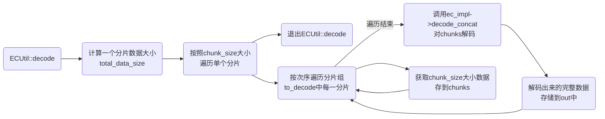
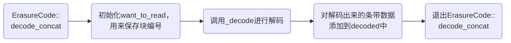
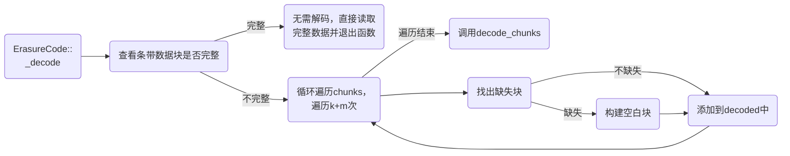
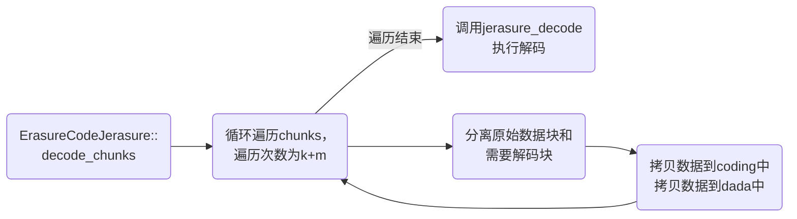

> Ceph版本：14.2.22  

&nbsp;
### 1. ECBackend::objects_read_and_reconstruct
`文件路径：ceph/src/osd/ECBackend.cc`

osd在读数据时，最终通过ECBackend::objects_read_and_reconstruc方法，在该方法中调用ECBackend::start_read_op方法读数据。
```cpp
void ECBackend::objects_read_and_reconstruct(
  const map<hobject_t,
  std::list<boost::tuple<uint64_t, uint64_t, uint32_t>>> &reads,
  bool fast_read,
  GenContextURef<map<hobject_t, pair<int, extent_map>> &&> &&func)
{
  in_progress_client_reads.emplace_back(reads.size(), std::move(func));

  if (!reads.size())
  {
    kick_reads();
    return;
  }

  //构造读object队列
  map<hobject_t, set<int>> obj_want_to_read;
  //构造读的循序队列
  set<int> want_to_read;
  //获取分片
  get_want_to_read_shards(&want_to_read);
  map<hobject_t, read_request_t> for_read_op;

  //初始化for_read_op
  for (auto &&to_read : reads)
  {
    //构造单个分片对象
    map<pg_shard_t, vector<pair<int, int>>> shards;
    //初始化shards
    int r = get_min_avail_to_read_shards(to_read.first, want_to_read, false, fast_read, &shards);
    ceph_assert(r == 0);

    CallClientContexts *c = new CallClientContexts(to_read.first, this, &(in_progress_client_reads.back()), to_read.second);
    //初始化for_read_op
    for_read_op.insert(make_pair(to_read.first, read_request_t(to_read.second, shards, false, c)));
    //初始化obj_want_to_read
    obj_want_to_read.insert(make_pair(to_read.first, want_to_read));
  }

  //开始读
  start_read_op(CEPH_MSG_PRIO_DEFAULT, obj_want_to_read, for_read_op, OpRequestRef(), fast_read, false);
  return;
}
```

### 2. CallClientContexts::finish
`文件路径：ceph/src/osd/ECBackend.cc`

上面分析到，ECBackend::start_read_op读完数据之后，CallClientContexts类对象会自动调用回调方法finish，finish方法会调用ECUtil::decode对读的数据进行解码。
```cpp
void finish(pair<RecoveryMessages *, ECBackend::read_result_t &> &in) override
{
  ECBackend::read_result_t &res = in.second;
  extent_map result;

  if (res.r != 0)
    goto out;

  ceph_assert(res.returned.size() == to_read.size());
  ceph_assert(res.errors.empty());

  for (auto &&read : to_read)
  {
    pair<uint64_t, uint64_t> adjusted =
    ec->sinfo.offset_len_to_stripe_bounds(make_pair(read.get<0>(), read.get<1>()));
    ceph_assert(res.returned.front().get<0>() == adjusted.first &&
    res.returned.front().get<1>() == adjusted.second);
    map<int, bufferlist> to_decode;
    bufferlist bl;

    for (map<pg_shard_t, bufferlist>::iterator j = res.returned.front().get<2>().begin();
          j != res.returned.front().get<2>().end(); ++j)
    {
      to_decode[j->first.shard].claim(j->second);
    }

    int r = ECUtil::decode(ec->sinfo, ec->ec_impl, to_decode, &bl);

    if (r < 0)
    {
      res.r = r;
      goto out;
    }

    //分割
    bufferlist trimmed;
    trimmed.substr_of(bl, read.get<0>() - adjusted.first,
    std::min(read.get<1>(), bl.length() - (read.get<0>() - adjusted.first)));
    //将数据插入到result
    result.insert(read.get<0>(), trimmed.length(), std::move(trimmed));
    res.returned.pop_front();
  }

  out:
    //返回读的数据
    status->complete_object(hoid, res.r, std::move(result));
    ec->kick_reads();
}
```

### 3. ECUtil::decode
`文件路径：ceph/src/osd/ECUtil.cc`

上面分析到，ECUtil::decode方法是纠删码解码的入口，该方法中主要思路为：遍历分片组中的每一个分片，按照次序从第一个分片到最后一个分片取chunk_size大小的数据，组装成一个条带数据，然后对这个条带数据进行解码，将解码后的完整条带数据追加到bufferlist中。


```cpp
int ECUtil::decode(
  const stripe_info_t &sinfo,
  ErasureCodeInterfaceRef &ec_impl, map<int, bufferlist> &to_decode,
  bufferlist *out)
{
  ceph_assert(to_decode.size());
  //获取单个分片的数据总大小
  uint64_t total_data_size = to_decode.begin()->second.length();
  ceph_assert(total_data_size % sinfo.get_chunk_size() == 0);
  ceph_assert(out);
  ceph_assert(out->length() == 0);

  for (map<int, bufferlist>::iterator i = to_decode.begin(); i != to_decode.end(); ++i)
  {
    ceph_assert(i->second.length() == total_data_size);
  }

  if (total_data_size == 0)
  {
    return 0;
  }

  //for:此处是以某个分片为基点,以当前分片上块为单元,寻找其他分片对应的块
  //for:集齐k个块数据，拼接成一个条带,以条带为单元进行解码
  for (uint64_t i = 0; i < total_data_size; i += sinfo.get_chunk_size())
  {
    map<int, bufferlist> chunks;

    //for:依次获取不同分片上的块数据,此处获取一个条带的数据
    for (map<int, bufferlist>::iterator j = to_decode.begin(); j != to_decode.end(); ++j)
    {
      chunks[j->first].substr_of(j->second, i, sinfo.get_chunk_size());
    }

    bufferlist bl;//存放解码之后单个条带的数据
    int r = ec_impl->decode_concat(chunks, &bl);//对单个条带数据进行解码

    ceph_assert(r == 0);
    ceph_assert(bl.length() == sinfo.get_stripe_width());

    out->claim_append(bl);//将解码之后的单个条带数据依次追加到out中
  }
  return 0;
}
```

### 4. ErasureCode::decode_concat
`文件路径：ceph/src/erasure-code/ErasureCode.cc`

上面分析到，ECUtil::decode方法最终会调用ec_impl->decode_concat对单个条带数据解码，decode_concat是类ErasureCode的方法。该方法会创建一个新的bufferlist对象，该对象用于存放解码之后的条带数据，该条带数据是完整的，没有任何缺失块。然后调用ErasureCode::_decode方法做进一步处理，最后将完整的条带数据追加到主调方法ECUtil::decode的bl参数中。


```cpp
int ErasureCode::decode_concat(
  const map<int, bufferlist> &chunks,
  bufferlist *decoded)
{
  set<int> want_to_read;//保存块数据的编号

  //for:初始化want_to_read，k=get_data_chunk_count
  for (unsigned int i = 0; i < get_data_chunk_count(); i++)
  {
    want_to_read.insert(chunk_index(i));
  }

  map<int, bufferlist> decoded_map;//存放解码之后完整有序的单个条带数据
  //对chunks做进一步处理
  int r = _decode(want_to_read, chunks, &decoded_map);

  if (r == 0)
  {
    for (unsigned int i = 0; i < get_data_chunk_count(); i++)
    {
      //将解码之后的块数据按顺序添加到decoded中,凑成一个条带数据
      decoded->claim_append(decoded_map[chunk_index(i)]);
    }
  }

  return r;
}
```

### 5. ErasureCode::_decode
`文件路径：ceph/src/erasure-code/ErasureCode.cc`

上面分析到，ErasureCode::decode_concat会调用_decode做进一步解码操作，decode_concat是类ErasureCode的方法。该方法首先会判断当前需要解码的条带数据(数据块+校验块)是否完整，如果完整，直接将chunks中的块数据复制到decoded中。如果不完整，再执行解码前准备工作。在这个过程中，循环k+m次，检测chunks缺少多少块，并构建相同数量的空白块，追加到decode中。最后调用decode_chunks做进一步解码过程。


```cpp
int ErasureCode::_decode(
  const set<int> &want_to_read,
  const map<int, bufferlist> &chunks,
  map<int, bufferlist> *decoded)
{
  vector<int> have;
  have.reserve(chunks.size());//分配空间

  //for:初始化have数据
  for (map<int, bufferlist>::const_iterator i = chunks.begin(); i != chunks.end(); ++i)
  {
    have.push_back(i->first);
  }

  //查看数据块是否缺失,如果不缺失，直接将chunks中数据给decoded,然后直接返回
  if (includes(have.begin(), have.end(), want_to_read.begin(), want_to_read.end()))
  {
    for (set<int>::iterator i = want_to_read.begin(); i != want_to_read.end(); ++i)
    {
      (*decoded)[*i] = chunks.find(*i)->second;
    }
    return 0;
  }

  //如果数据块丢失，则执行解码
  unsigned int k = get_data_chunk_count();//获取数据块个数
  unsigned int m = get_chunk_count() - k;//获取校验快个数
  unsigned blocksize = (*chunks.begin()).second.length();//获取块大小

  //for:构造出完整的单条带数据
  for (unsigned int i = 0; i < k + m; i++)
  {
    //如果数据块丢失,构造出一个空的数据块,凑齐完整的一个条带
    if (chunks.find(i) == chunks.end())
    {
      //构造缺失的块数据,默认数据为空
      bufferlist tmp;
      bufferptr ptr(buffer::create_aligned(blocksize, SIMD_ALIGN));
      tmp.push_back(ptr);
      tmp.claim_append((*decoded)[i]);
      (*decoded)[i].swap(tmp);
    }
    else
    {
      //如果不缺,直接取出数据块中的数据
      (*decoded)[i] = chunks.find(i)->second;
      (*decoded)[i].rebuild_aligned(SIMD_ALIGN);
    }
  }

  //对decoded数据进一步处理
  return decode_chunks(want_to_read, chunks, decoded);
}
```
have和want_to_read区别：have中保存的chunks中块的编号，可能有缺失的块。want_to_read是逻辑上块的编号，一定是完整的。

### 6. ErasureCodeJerasure::decode_chunks
`文件路径：ceph/src/erasure-code/jerasure/ErasureCodeJerasure.cc`

上面分析到，ErasureCode::_decode最终会调用decode_chunks方法对decoded进一步处理。decoded是类ErasureCodeJerasure的方法。在该方法中会对单条带数据进行分离，分离出解码过程需要的原数据块data和需要解码出来的数据块coding，data中一定包含数据块和校验块，coding中可能是单纯的数据块，也可能是数据块和校验块。然后调用接口做进一步处理。


```cpp
int ErasureCodeJerasure::decode_chunks(const set<int> &want_to_read, const map<int, bufferlist> &chunks,
                                       map<int, bufferlist> *decoded)
{
    unsigned blocksize = (*chunks.begin()).second.length();//统计块数据的大小
    int erasures[k + m + 1];//记录丢失块编号
    int erasures_count = 0;//统计丢失块数量
    char *data[k];//数据块
    char *coding[m];//校验快

    for (int i = 0; i < k + m; i++)
    {
        //记录丢失块编号
        if (chunks.find(i) == chunks.end())
        {
            erasures[erasures_count] = i;//记录丢失块编号
            erasures_count++;//统计丢失块数量
        }

        //筛选解码需要的数据块和解码出来的数据块
        if (i < k)
            data[i] = (*decoded)[i].c_str();//拷贝未丢失块数据(数据块+校验块)
        else
            coding[i - k] = (*decoded)[i].c_str();//拷贝丢失块数据(未知数据)
    }
    //结束标志
    erasures[erasures_count] = -1;

    ceph_assert(erasures_count > 0);
    //调用范德蒙矩阵解码接口
    return jerasure_decode(erasures, data, coding, blocksize);
}
```

### 7. ErasureCodeJerasureReedSolomonVandermonde::jerasure_decode
`文件路径：ceph/src/erasure-code/jerasure/ErasureCodeJerasure.cc`

上面分析到，ErasureCodeJerasure::decode_chunks最终会调用jerasure_decode方法做进一步处理，jerasure_decode是ErasureCodeJerasureReedSolomonVandermonde方法。该方法调用纠删码解码C语言接口，纠删码解码方法有很多，目前使用的是范德蒙行列式解码。
```cpp
int ErasureCodeJerasureReedSolomonVandermonde::jerasure_decode(
  int *erasures,
  char **data,
  char **coding,
  int blocksize)
{
  //调用jerasure接口,将data中构造出的空数据用解码出来的数据进行覆盖
  return jerasure_matrix_decode(k, m, w, matrix, 1, erasures, data, coding, blocksize);
}
```